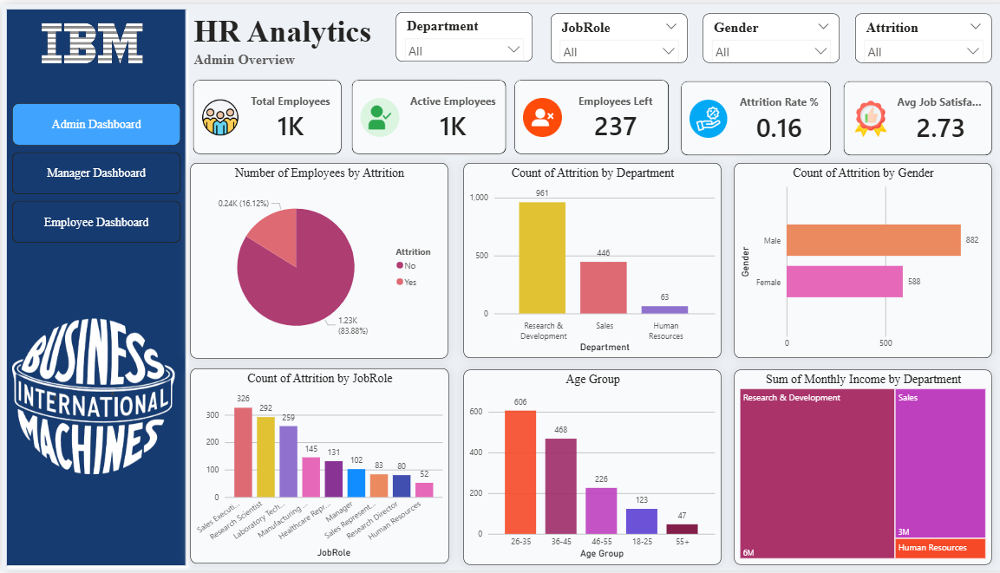
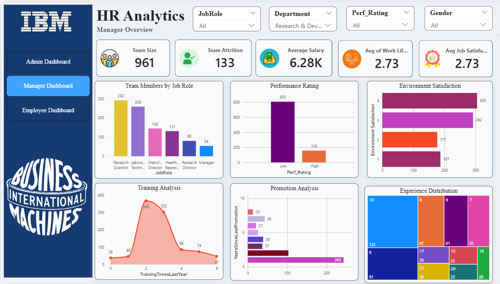
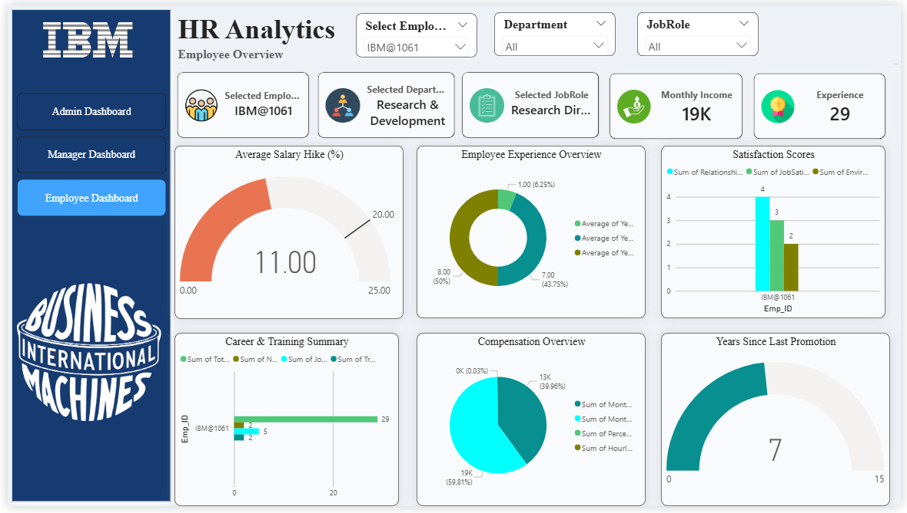

# IBM HR Analytics Dashboard

## Project Overview

This Power BI dashboard provides a complete HR Analytics solution for monitoring employee performance, attrition, salary, satisfaction, promotions, and workforce insights. It enables HR teams, managers, and executives to make informed, data-driven decisions.

---

## Dashboard Preview

### Admin Dashboard

The Admin Dashboard provides an overall view of the organization's workforce.

**Key Metrics**
- Total Employees
- Active Employees
- Employees Left
- Attrition Rate
- Average Job Satisfaction

**Visualizations**
- Attrition Analysis
- Department-wise Attrition
- Gender-wise Attrition
- Job Role Analysis
- Age Group Distribution
- Monthly Income by Department

---

### Manager Dashboard

The Manager Dashboard helps managers monitor team performance.

**Key Metrics**
- Team Size
- Team Attrition
- Average Salary
- Work-Life Balance
- Job Satisfaction

**Visualizations**
- Team Members by Job Role
- Performance Rating
- Environment Satisfaction
- Training Analysis
- Promotion Analysis
- Experience Distribution

---

### Employee Dashboard

The Employee Dashboard provides detailed information for individual employees.

**Key Metrics**
- Employee Details
- Department
- Job Role
- Monthly Income
- Experience

**Visualizations**
- Salary Hike
- Experience Overview
- Satisfaction Scores
- Career & Training Summary
- Compensation Overview
- Years Since Last Promotion

---

## Dataset

The dashboard uses an HR Analytics dataset containing:

- Employee ID
- Department
- Job Role
- Gender
- Age
- Attrition
- Monthly Income
- Years at Company
- Performance Rating
- Job Satisfaction
- Environment Satisfaction
- Work-Life Balance
- Training Times
- Promotion History

---

## Tools Used

- Power BI
- Microsoft Excel
- DAX
- Power Query
- Data Modeling

---

## Key Insights

- Research & Development has the largest workforce.
- Most employees belong to the 26–35 age group.
- Attrition varies across departments and job roles.
- Salary and promotion trends provide valuable workforce insights.
- Employee satisfaction metrics help identify retention opportunities.

---

## Project Features

- Interactive Slicers
- KPI Cards
- Bar Charts
- Column Charts
- Pie Charts
- Donut Charts
- Gauge Charts
- Treemap
- Employee-Level Analysis
- Manager-Level Analysis
- Admin-Level Analysis

---

## Author

**Anwar Shaikh**

Aspiring Data Analyst

### Skills

- Excel
- SQL
- Power BI
- Python
- Data Analytics
